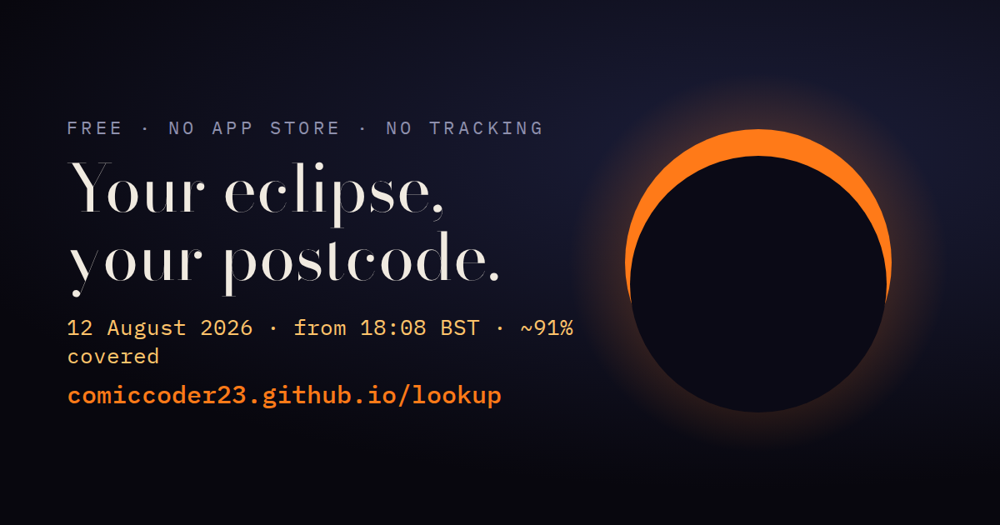

# 🌒 Look Up — your eclipse, your postcode

**Live: [comiccoder23.github.io/lookup](https://comiccoder23.github.io/lookup/)**

Eclipse companion for the partial solar eclipse of **12 August 2026** (18:08–20:01 BST over the UK and Ireland, ~90–94% of the Sun covered). Type your town — or use your location — and it computes **your** eclipse, to the second, for exactly where you're standing.

## What it does

- **Exact times from your own coordinates** — first contact, deepest point, last contact, computed on your phone with Meeus lunar and solar theory plus a topocentric correction (adjusted for your spot on the Earth's surface, not the centre of the planet). Verified against published timings for sixteen cities to within seven seconds.
- **A live sky view** — the crescent drawn from the real geometry, with a scrubber to preview any moment of the eclipse.
- **A voice guide** — put your phone in your pocket and it talks you through the whole event: when to look, what to notice, when the good bits are.
- **Cloudy? Plan B built in** — [chase.html](https://comiccoder23.github.io/lookup/chase.html) samples the cloud forecast at 37 points within 40 km of you and points you at the clearest sky, with directions by car or public transport, plus every free live stream including totality from Spain.
- **Share cards** — a 1080×1350 card of your town's eclipse, drawn from the real geometry, ready to post.
- **Calendar export, cloud forecast, Perseids the same night** — the whole day, one page.
- **Installs like an app** — open it in your browser → "Add to Home screen". Works offline once loaded.

## Eye safety

Never look at the Sun without **ISO 12312-2** eclipse glasses — the standard is printed on the frame of real ones. Sunglasses do not protect you. No glasses? The crescents projected through tree leaves onto the ground are the best part anyway, and completely safe.

## How it's built

One HTML file, vanilla JavaScript, zero frameworks, zero build step. GitHub Pages hosting. Cloud data from [Open-Meteo](https://open-meteo.com/). **No tracking, no analytics, no signup — your location is computed on your phone and never sent anywhere.** There is no server to send it to.

## Support

Free forever. If it made your eclipse better: [☕ the tip jar](https://ko-fi.com/comiccoder23), entirely optional.

---

*Built by [@ComicCoder23](https://github.com/ComicCoder23) — one stubborn human and a crew of AI agents. Shipped from a phone the day before the eclipse.*
